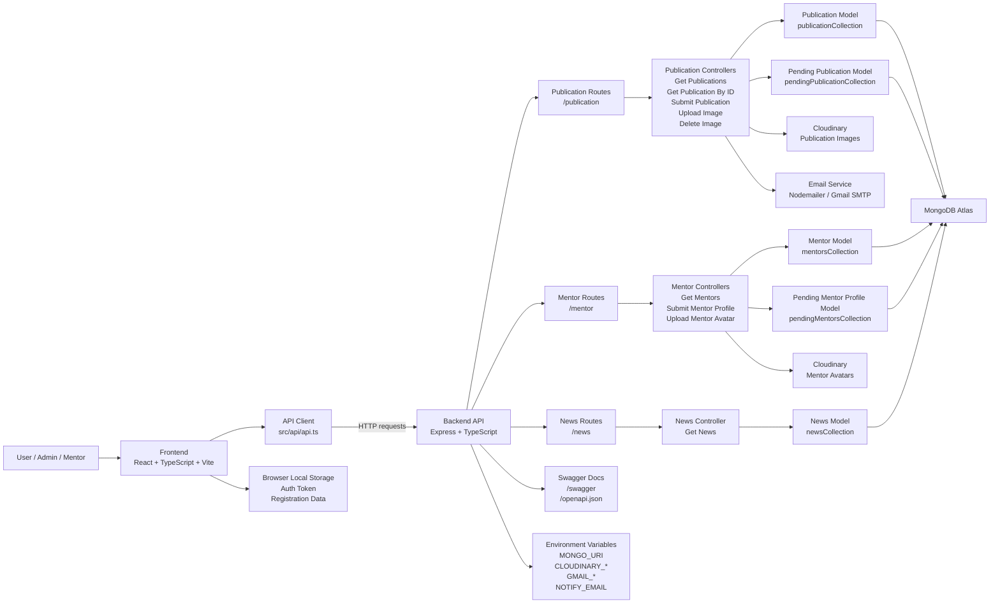

# SRC2026 Frontend

SRC2026 is the frontend web application for the Science Research Festival 2026 platform. It is built with React, TypeScript, Vite, Tailwind CSS, and DaisyUI, and connects to the SRC2026 backend API for mentors, publications, submissions, news, image uploads, and notification-backed workflows.

## Tech Stack

- React 19
- TypeScript
- Vite
- React Router
- Tailwind CSS
- DaisyUI
- React Icons
- Fetch API client in `src/api/api.ts`

## Features

- Public event landing page with hero, about, research fields, awards, regulations, milestones, news, publications, workshops, and footer sections.
- Mentor directory with live API data, department filtering, search, and pagination.
- Publications pages with API-backed listing and detail views.
- News list and detail pages.
- Submission page for mentor profile CSV data and publication BibTeX data.
- Registration form stored in browser local storage.
- Authentication UI pages and protected admin route using locally stored auth token.
- SPA deployment support through Vercel rewrites.

## System Architecture



## Project Structure

```text
src/
  api/                 API endpoint definitions and response normalization
  assets/              Images and static visual assets
  components/          Page sections, pages, and reusable UI components
  data/                Static fallback/content data
  hook/                Shared React hooks
  App.tsx              Home page composition
  main.tsx             React Router setup and app bootstrap
```

## Frontend Routes

| Route | Purpose |
| --- | --- |
| `/home` | Main SRC2026 landing page |
| `/mentors` | Mentor directory |
| `/news-list` | News listing |
| `/news-list/:id` | News detail |
| `/publications` | Publications listing |
| `/publications/:id` | Publication detail |
| `/submit` | Mentor and publication submission |
| `/register` | Research registration form |
| `/admin` | Protected admin page |
| `/auth/login` | Login page |
| `/auth/signup` | Signup page |

## API Configuration

The frontend reads the backend base URL from `VITE_API_BASE_URL`.

Create a `.env` file in this directory when running against a local or custom backend:

```env
VITE_API_BASE_URL=http://localhost:3000
```

If `VITE_API_BASE_URL` is not set, the app uses:

```text
https://src2026backendmain.vercel.app
```

Primary API calls are defined in `src/api/api.ts`:

- `GET /mentor`
- `POST /mentor/submit`
- `GET /publication`
- `POST /publication/submit`
- `POST /auth/signup`
- `POST /auth/login`

Note: the frontend currently defines auth API calls, but the backend entry point in this workspace mounts publication, mentor, news, Swagger, and OpenAPI routes.

## Getting Started

Install dependencies:

```bash
npm install
```

Start the development server:

```bash
npm run dev
```

Build for production:

```bash
npm run build
```

Preview the production build:

```bash
npm run preview
```

Run linting:

```bash
npm run lint
```

## Deployment

This app is ready for SPA deployment on Vercel. The `vercel.json` file rewrites all routes back to `/`, allowing React Router routes such as `/mentors` and `/publications/:id` to load correctly on refresh.

```json
{
  "rewrites": [{ "source": "/(.*)", "destination": "/" }]
}
```

## Related Backend

The backend for this frontend lives in the sibling project:

```text
../src2026_backend_main
```

It provides the Express API, MongoDB persistence, Cloudinary upload integration, Nodemailer email notifications, and Swagger documentation.
